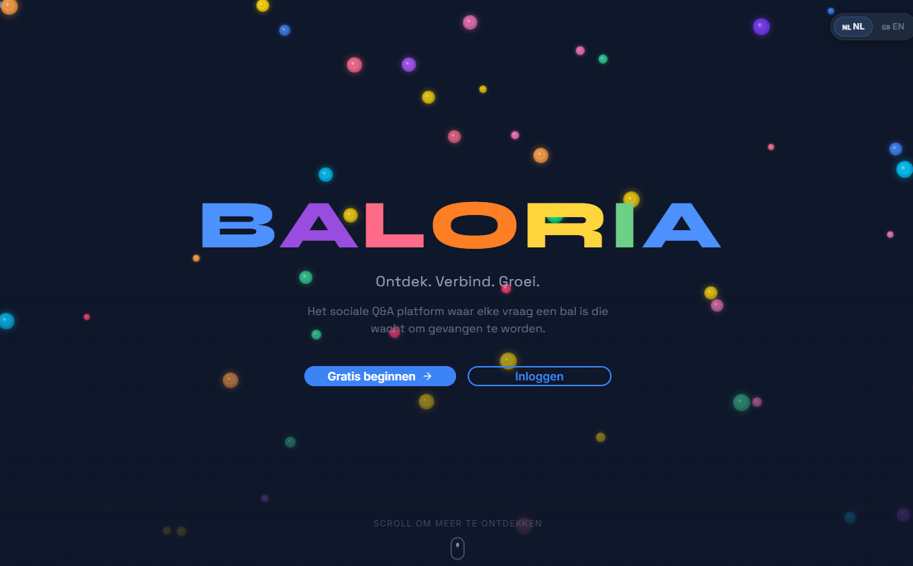

# 🎱 Baloria — Sociaal Q&A Platform



**Ontdek. Verbind. Groei.**

Baloria is een revolutionair sociaal platform waar jouw vragen letterlijk als kleurrijke ballen door een virtuele ruimte zweven. Vang een bal, geef een antwoord, en maak een echte connectie.

## ✨ Features

- 🎾 **Ballebak** — Stel vragen als kleurrijke ballen en vang vragen van anderen
- 🔒 **Privacy-first** — Identity Bridge beschermt je identiteit
- ⚡ **15-minuten antwoorden** — Snelle, intentionele interacties
- 🌐 **Meertalig** — Nederlands en Engels
- 👤 **Admin Panel** — Gebruikersbeheer, security, SEO en moderatie
- 💬 **Chat** — Directe berichten met andere gebruikers
- ❤️ **Karma systeem** — Verdien hartjes en bouw je reputatie op

## 🛠 Tech Stack

- **Frontend:** React 18 + TypeScript + Vite
- **Styling:** Tailwind CSS + shadcn/ui
- **Animation:** Framer Motion
- **Backend:** Supabase (Auth, Database, Edge Functions)
- **Deployment:** Lovable Cloud

## 🚀 Getting Started

```bash
# Clone the repository
git clone <YOUR_GIT_URL>

# Navigate to the project
cd baloria

# Install dependencies
npm install

# Start development server
npm run dev
```

De app draait op `http://localhost:8080`.

## 📁 Project Structure

```
src/
├── components/
│   ├── dashboard/     # Dashboard sections (Ballebak, Chat, Admin, etc.)
│   ├── landing/       # Landing page components
│   └── ui/            # shadcn/ui components
├── hooks/             # Custom hooks (auth, language, roles)
├── pages/             # Route pages
├── lib/               # Utilities and categories
└── integrations/      # Supabase client & types
```

## 🌍 Meertaligheid

Baloria ondersteunt Nederlands (NL) en Engels (EN). De taal kan gewisseld worden via de knop op de landing page. Voorkeur wordt opgeslagen in localStorage.

## 🔐 Security

- Row Level Security (RLS) op alle database tabellen
- Role-based access control (Admin, Moderator, User)
- Client-side code protection tegen casual kopiëren
- IP blocking en security event logging

## 📄 License

© 2025 Baloria — Alle rechten voorbehouden.
